# Real Time Chat App

## Table of contents
- [Real Time Chat App](#real-time-chat-app)
  - [Table of contents](#table-of-contents)
  - [App Logic](#app-logic)
    - [Main Tasks](#main-tasks)
    - [How it should run](#how-it-should-run)
  - [run in dev environment](#run-in-dev-environment)
  - [Run docker for production](#run-docker-for-production)


## App Logic
Базовое моделирование приложения для чата в реальном времени, в котором пользователь должен пройти аутентификацию, чтобы начать чат. Пользователь может вести как приватный, так и групповой чат.

### Main Tasks
- [x] реализована аутентификация на основе токенов
- [x] чат один на один или личный чат
- [x] создать группу и вступить в группу
- [x] Базовая система друзей
- [x] написал асинхронных потребителей, используя каналы Django
- [x] Докеризованное приложение для стадии разработки
- [x] отдельная логика приложения путем введения в приложение слоя «services»
- [x] разделенное взаимодействие с базой данных путем введения слоя «selectors»
- [x] кэширование слоев с помощью Redis
- [x] Основное хранилище данных с использованием PostgreSQL
  
### How it should run
1. sign up new user
  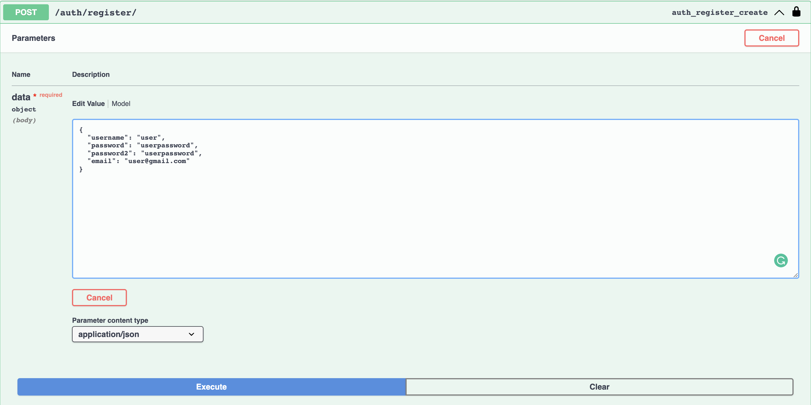
2. login the new user and get the tokens
  - login using user credentials
      - 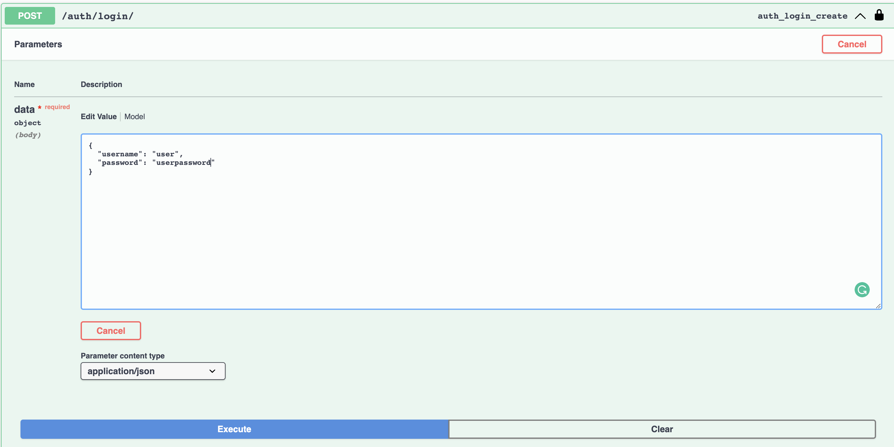
  - get tokens
   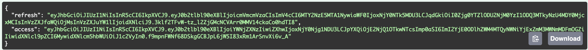
  - get authenticated on the swagger page
    - 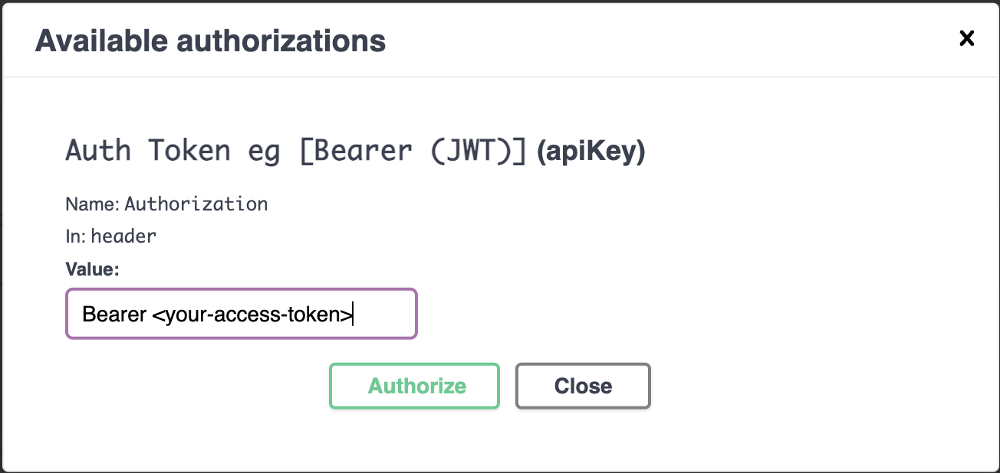
3. choose chat
   - with a friend
      - add this friends to your friends
        - 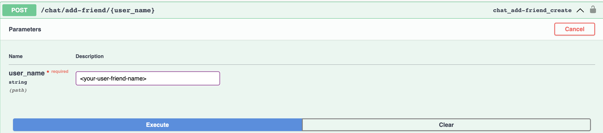
      - get the websocket url
        - 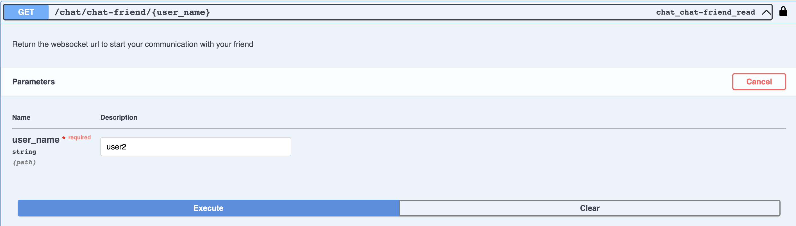
        - response
          - 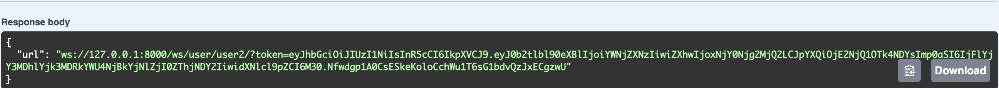
   - with a group
      - create a group if not exists
        - 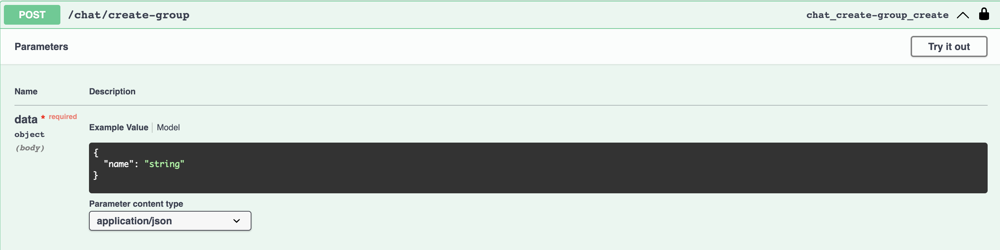
      - join the group
        - 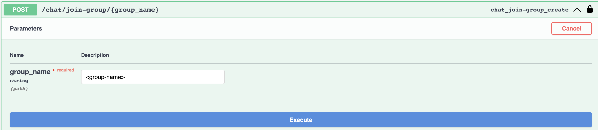
      - get the websocket url
        - 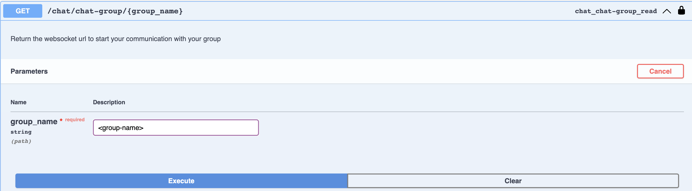
        - response
          - 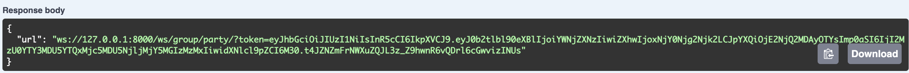
4. Connect to websocket client (recommended Postman)
   - enter your websocket uri
     - 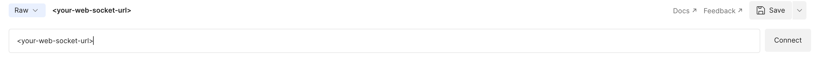
   - send your first action request  
     - 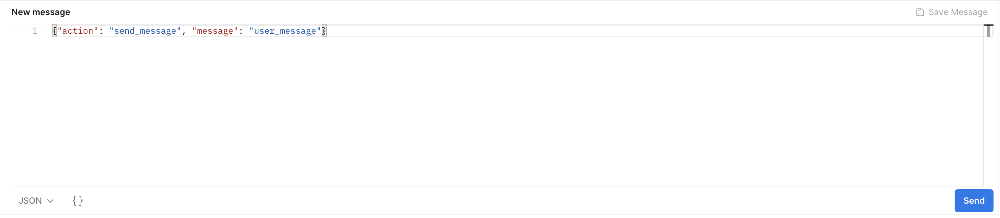
5. start chat
   - Send a message
      -  ``` {"action": "send_message", "message": "<your-msg>"} ```
   - Retrive a message
       -  ``` {"action": "retrieve_message", "number": <number-messages>} ```
          - **NOTE** - By default the number property is 10 if not specified

## run in dev environment

1. Создайте образ Docker
```
docker-compose --file docker-compose.dev.yml --project-name=chat_app build
```
2. запустить образ Docker
```
docker-compose --file docker-compose.dev.yml --project-name=chat_app up
```
3. остановить образ Docker
```
docker-compose --file docker-compose.dev.yml --project-name=chat_app up
```
- для удаления томов при остановке контейнеров
   ```
   docker-compose --file docker-compose.dev.yml --project-name=chat_app down -v --remove-orphans
   ```
  

## Run docker for production

1. Создайте образ Docker
```
docker-compose --file docker-compose.prod.yml --project-name=chat_app build
```
2. запустить образ Docker
```
docker-compose --file docker-compose.prod.yml --project-name=chat_app up
```
3. docker compose down
```
docker-compose --file docker-compose.prod.yml --project-name=chat_app down
```
- для удаления томов при остановке контейнеров
   ```
   docker-compose --file docker-compose.prod.yml --project-name=chat_app down -v --remove-orphans
   ```# chatapp-realtime
